# Joint Savings Account

## Background

[joint_savings.sol](src/joint_savings.sol) is a Solidity smart contract that creates a joint account from two user addresses.
Only these addresses will be able to control the joint savings account.
The smart contract allows the joint account owners to deposit and withdraw funds from the account.

## Results

### Test Functionality

#### Before contract is deployed

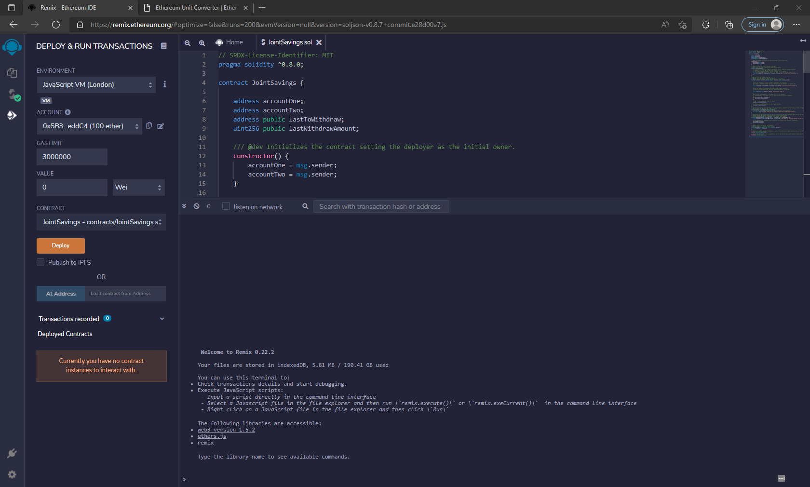

#### Contract creation

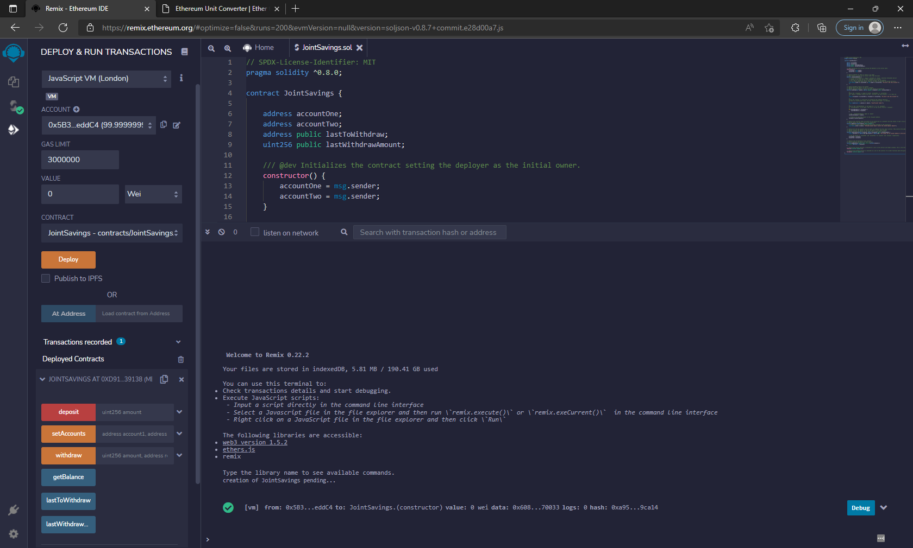

#### Set account values

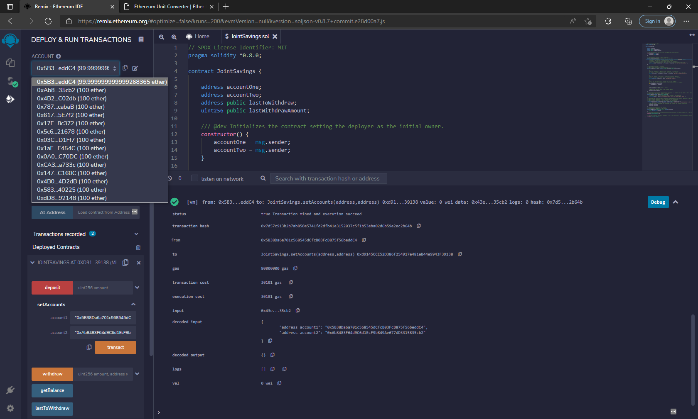

#### Send 1 ETH as wei

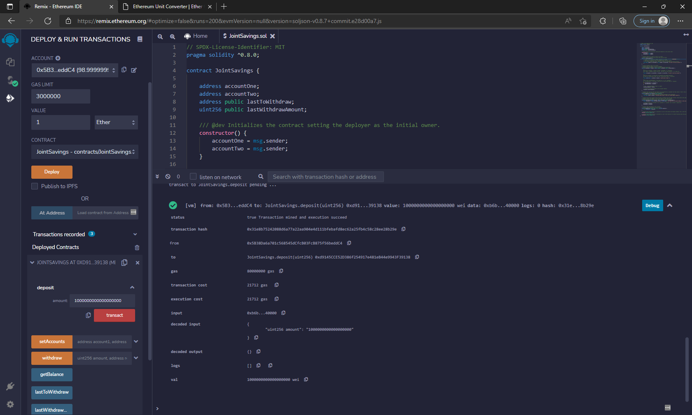

#### Get Balance

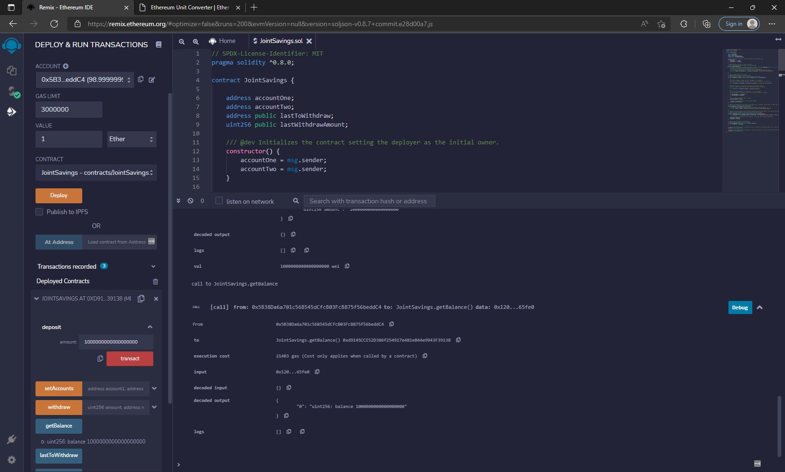

#### Send 10 ETH as wei

#### Get Balance

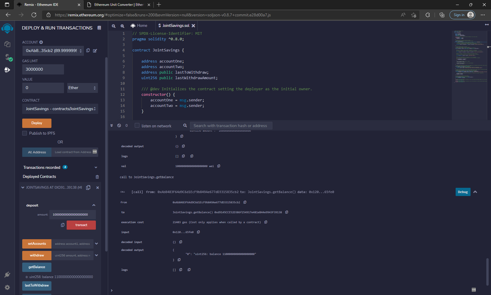

#### Send 5 ETH as wei

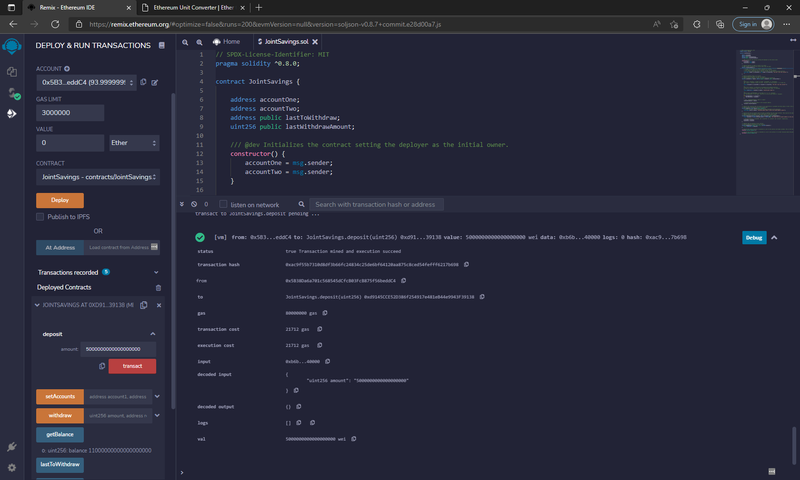

#### Get Balance

####  Withdraw 5 ETH into account 1

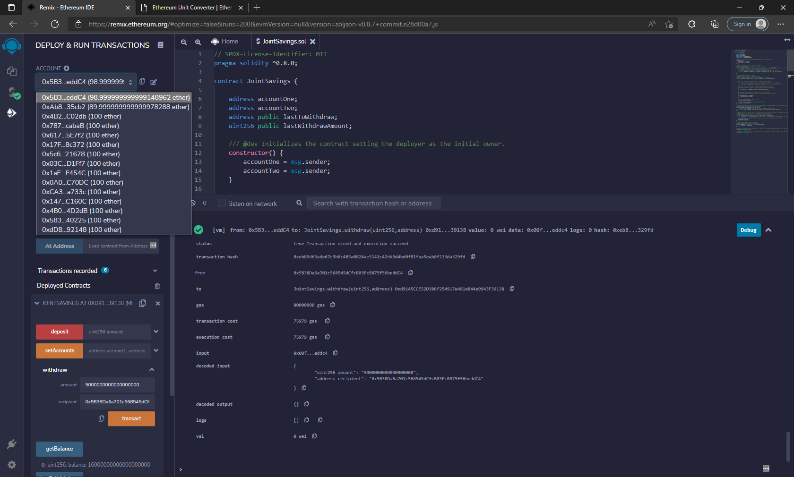

####  Get Balance, last to withdraw, last withdraw amount

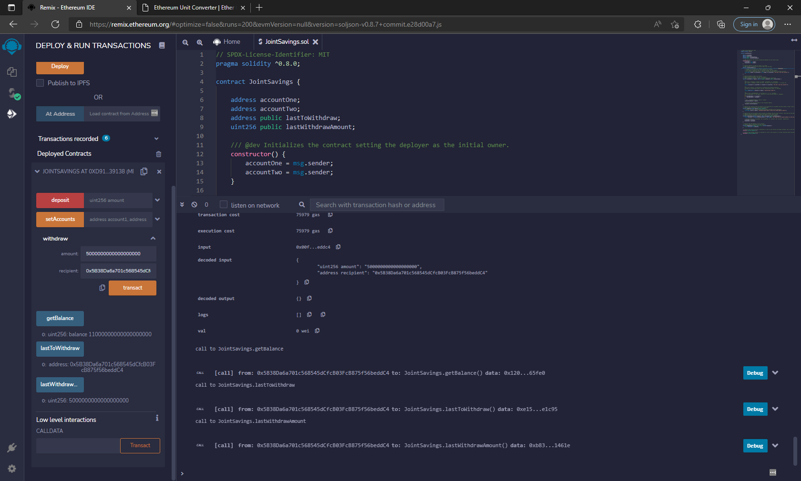

#### Withdraw 10 ETH into account 2

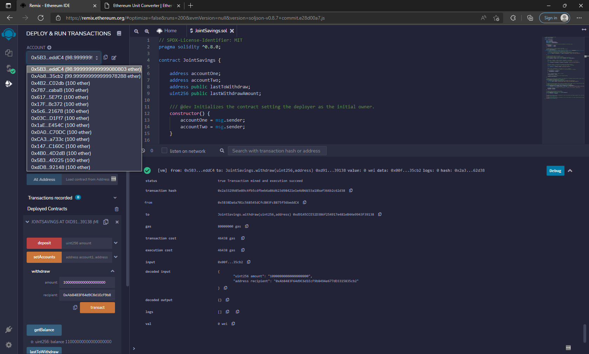

#### Get Balance, last to withdraw, last withdraw amount

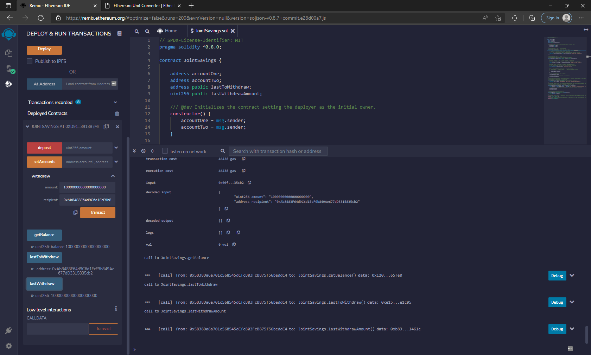

### Security Checks

#### Check that other accounts cannot setAccounts

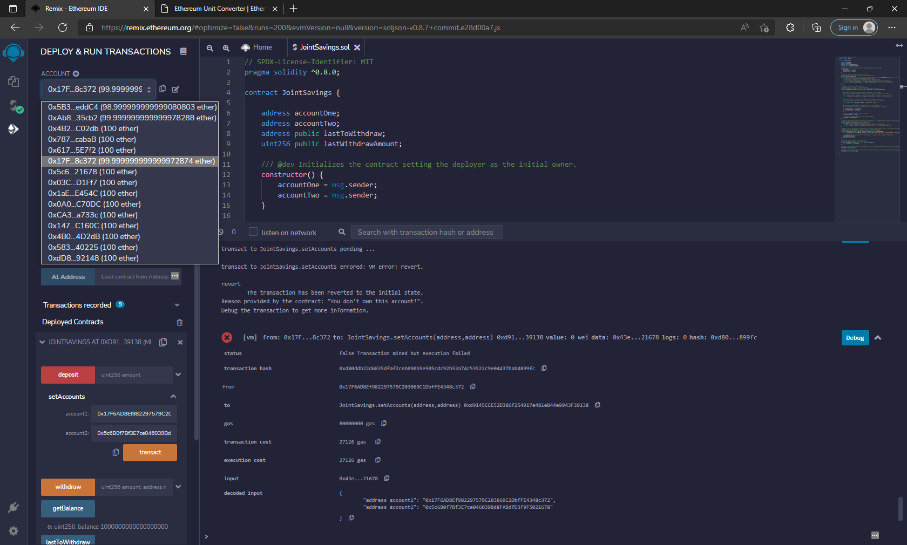

#### Check that other accounts cannot withdraw

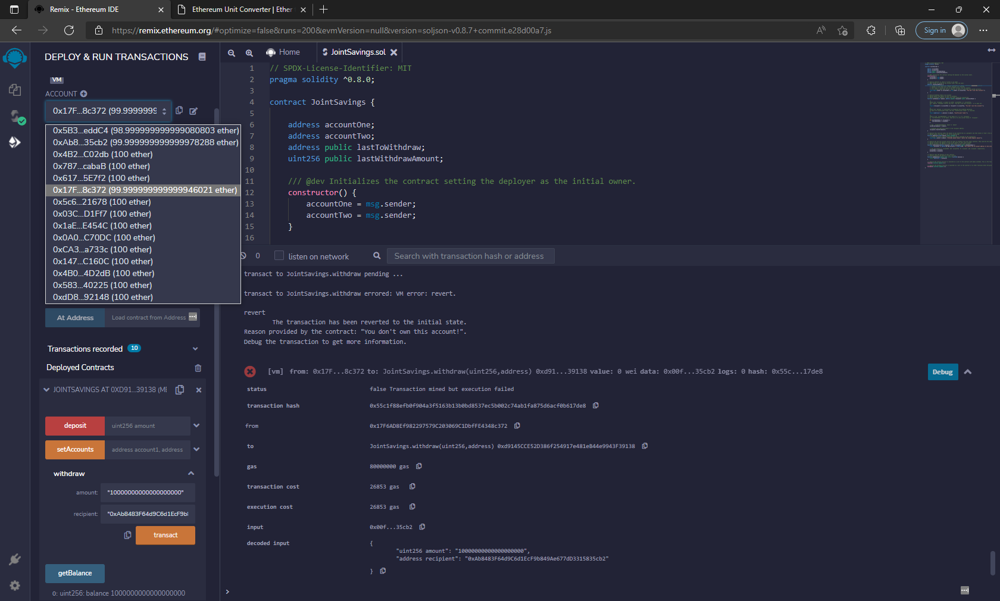

#### Check that the owners cannot set an account to the zero address (0x0000000000000000000000000000000000000000)

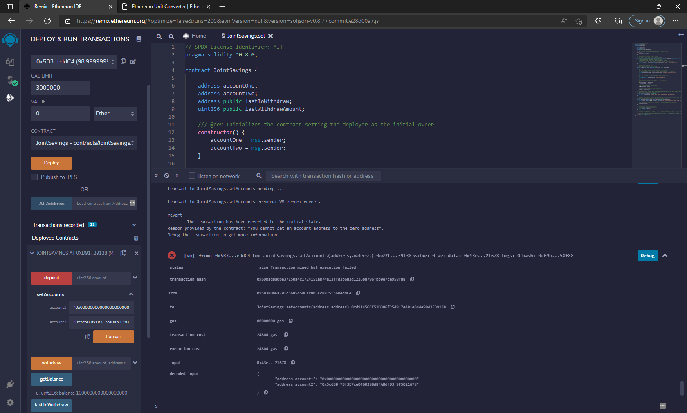

#### Check that the owners cannot withdraw more than the max funds

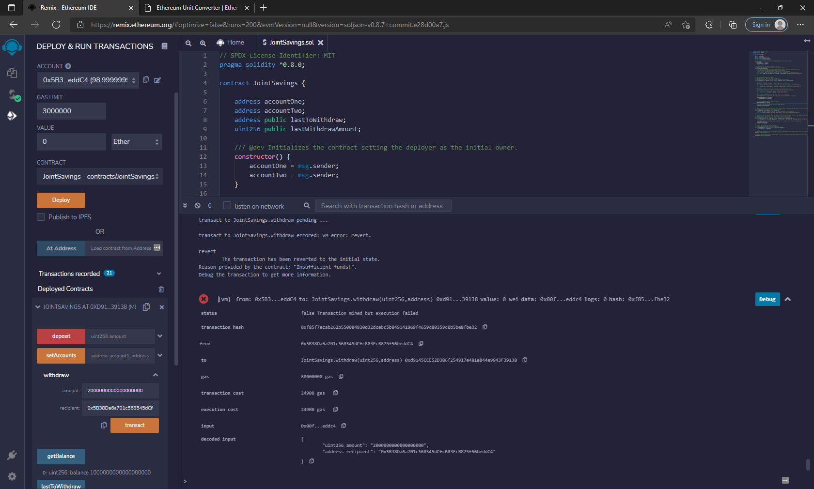
